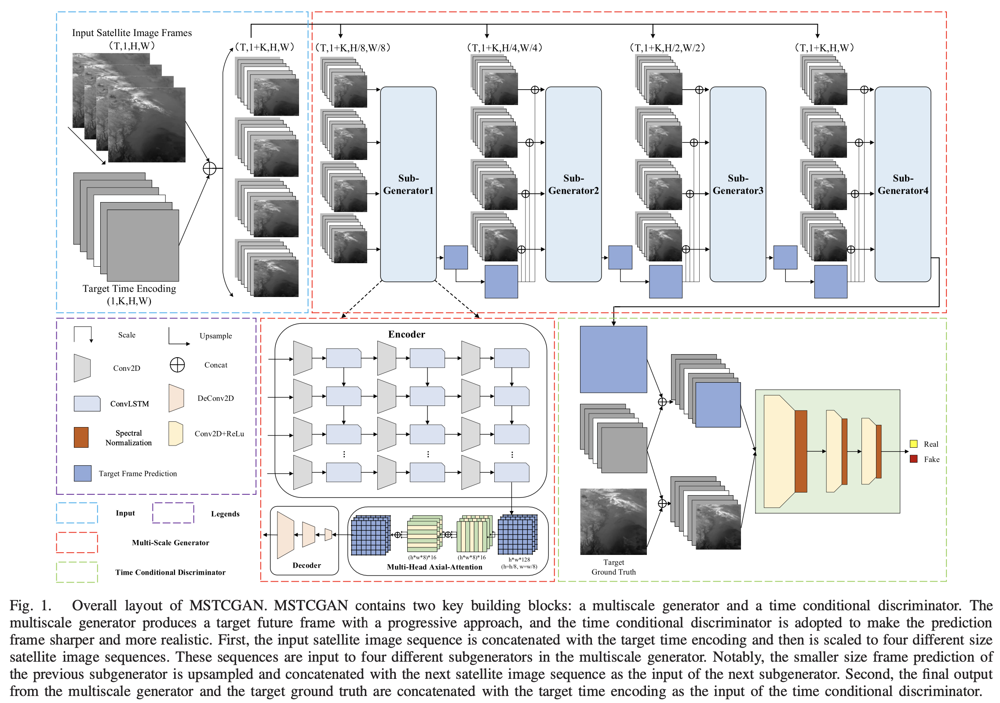
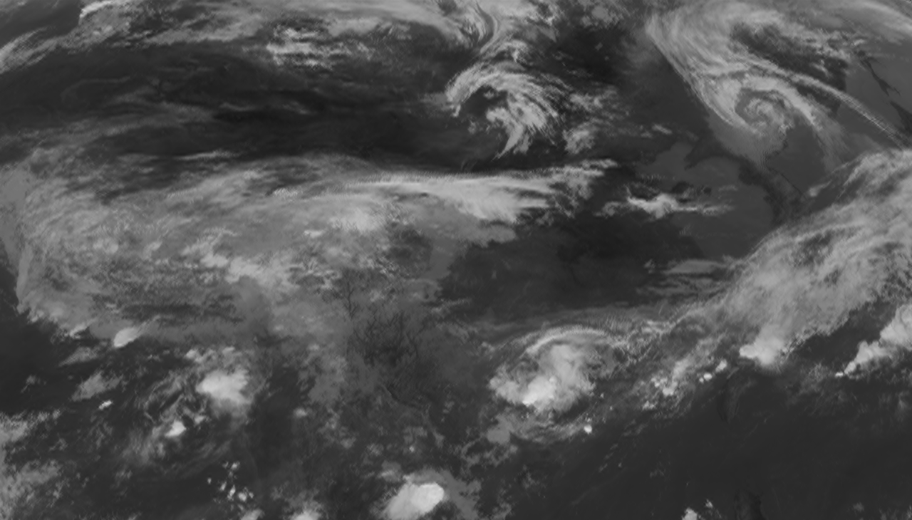
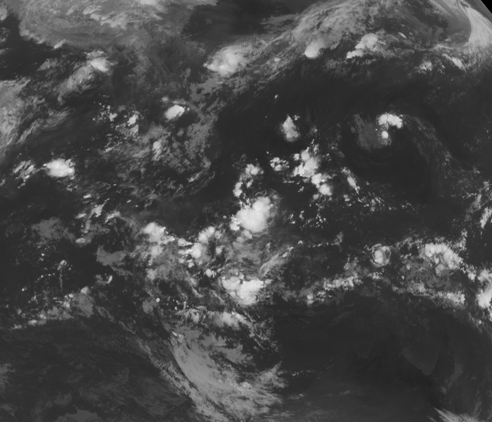
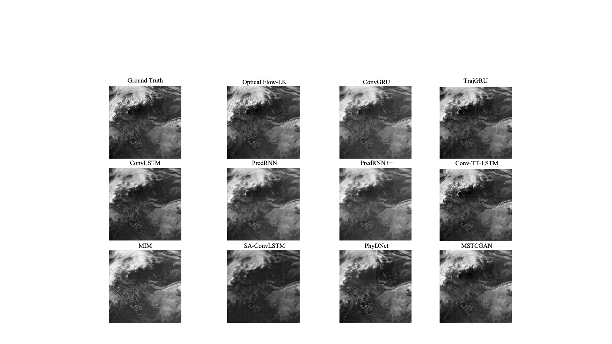
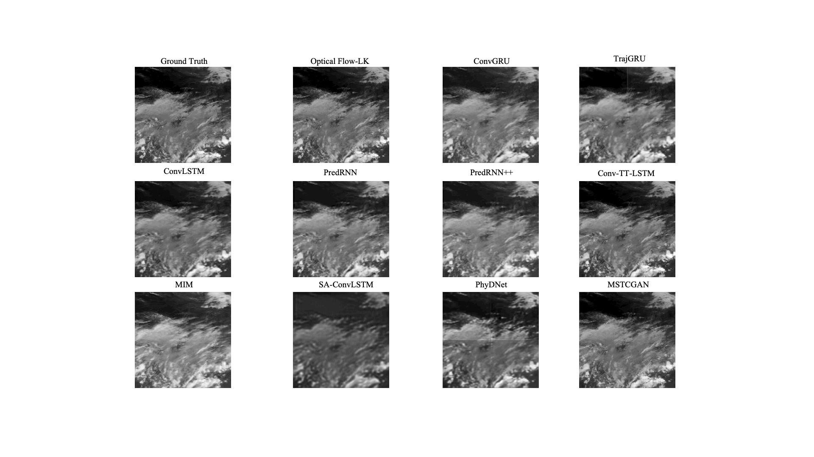

# MSTCGAN
code for MSTCGAN: Multiscale time conditional generative adversarial network for long-term satellite image sequence prediction




## Summary
We provide the [pretrained model](https://drive.google.com/drive/folders/1T1XN6eQL4OHmXm_SGTWlTU2WHewCgBtO?usp=sharing) and test scripts for 4-hour satellite nowcasting over the China mainland and southeast Aisa areas.

1. China mainland area


2. Southeast Aisa area


## Comparsion Samples




## Test
make satellite nowcasting over the China mainland area.
```
python single_test_china.py 
```

make satellite nowcasting over the southeast Aisa area.
```
python single_test_southeast.py
```

## Citation

If you are interested in our repository or our paper, please cite the following papers:

```

@article{dai2022mstcgan,
  title={MSTCGAN: Multiscale time conditional generative adversarial network for long-term satellite image sequence prediction},
  author={Dai, Kuai and Li, Xutao and Ye, Yunming and Feng, Shanshan and Qin, Danyu and Ye, Rui},
  journal={IEEE Transactions on Geoscience and Remote Sensing},
  volume={60},
  pages={1--16},
  year={2022},
  publisher={IEEE}
}
```